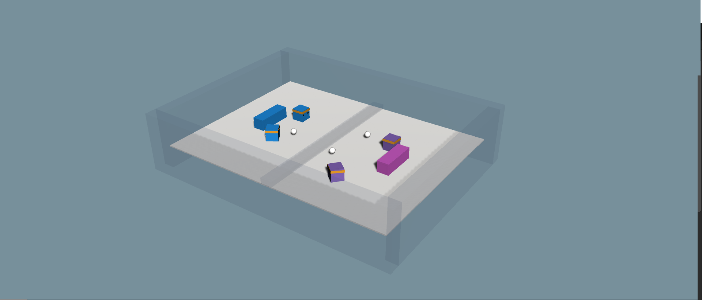

# Snowball Fight 🎄☃️, a multi-agent environment for ML-Agents
A multi-agent environment using Unity ML-Agents Toolkit where four agents compete in a 2vs2 snowball fight game.

## The Environment
- Four agents compete **in a 2 vs 2 snowball fight game**.
- The goal is to **hit the opponent team while avoiding the opponent and your teammate snowballs ❄️**.
- The aesthetics follows the ML-Agents and the implementation is inspired by the SoccerTwo environment.

### Observation Space
- Vector Observation space: 336 
    - **11 ray-casts forward** distributed over 100 degrees.
    - **3 ray-casts backward** distributed over 90 degrees.
    - Each  of the raycasts detecting 6 possible object types, along with the object's distance. 
      - Hence each raycast state dimensions = `nb of possible object (6) + Vector3 object's distance (3) * three obs stack (3) = 6+3*3 = 27`.
      - Therefore, the forward ray-casts contribute 264 state dimensions and backward 72 state dimensions over three observation stacks.
    - **Bool canShoot** (you can only shoot a snowball every 2 seconds).

### Action Space (Discrete) 
- Vector Action space:
  - **Four branched actions** corresponding to forward, backward, sideways movement, rotation, and snowball shoot.

### Agent Reward Function (dependant):
- (1 - accumulated time penalty): when a snowball hit one of the opponents accumulated time penalty is incremented by (1 / MaxStep) every fixed update and is reset to 0 at the beginning of an episode.
- (-1) When a snowball hit one of the agent of the team.

## How to use it 
- 1️⃣ Download the [ml-agents Release 10](https://github.com/Unity-Technologies/ml-agents/archive/release_10.zip) repository.
- 2️⃣ Clone this repository.
### On ML-Agents
- 3️⃣ Put the `SnowballFight.yaml` file to your ML-Agents folder into `.\config\ppo`.
### On Unity
- 4️ Open the Unity Project `Project` in ML-Agents repo.
- 5️ Import package > Custom package `snowballfight.unitypackage` file.

## The next steps
- (Currently updating it) Allow the simulation to continue until one of the team is completely defeated.
- Preparing an article that explains how Snowball fight works and multi-agents (Elo rating system, self-play etc), in the meantime if you want to know more about multi-agents check this [amazing blogpost from Unity team](https://blogs.unity3d.com/2020/02/28/training-intelligent-adversaries-using-self-play-with-ml-agents/).
